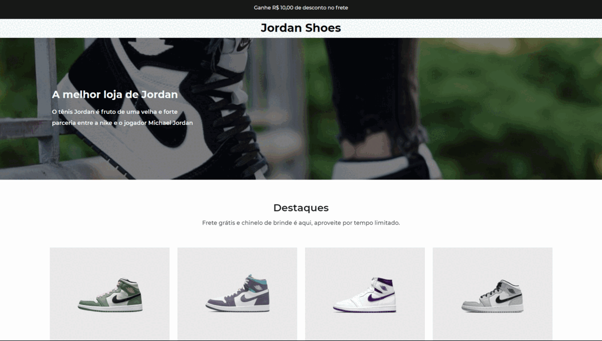

## 📖 Projeto

Este repositório contém desafios propostos pelo [Iuri Silva](https://www.instagram.com/iuricode/) no grupo do discord, [Codelândia](https://discord.com/invite/QevDJqCzaY).

- [Jordan Shoes](https://github.com/d0ugui/codelandia/tree/main/jordan-shoes)
- [Studio Ghibli](https://github.com/d0ugui/codelandia/tree/main/studio-ghibli)
- [Hallowen Memory Game](https://github.com/d0ugui/codelandia/tree/main/memory-game)
- [Rachi](https://github.com/d0ugui/codelandia/tree/main/rachi)

## 📝 Informações

Cada desafio contém um readme bem explicativo com as tecnologias utilizadas e layout do figma.
