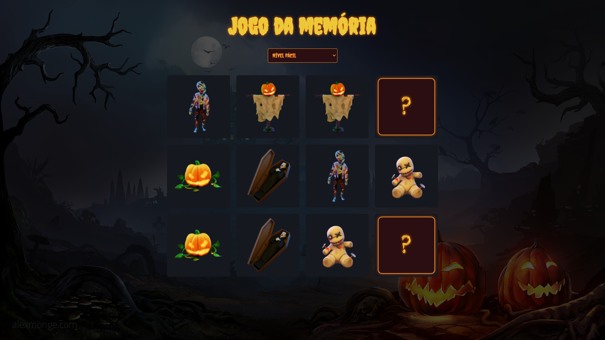

<!-- <p align="center">
  
</p> -->

## 📖 Projeto

- O projeto foi baseado em um desafio proposto no grupo do discord, [Codelandia](https://discord.com/invite/QevDJqCzaY). A aplicação consiste em um jogo da memória com 3 níveis de dificuldade.

## 🧪 Tecnologias

Esse projeto foi desenvolvido com as seguintes tecnologias e bibliotecas:

- [React](https://reactjs.org)
- [Styled-components](https://styled-components.com/)

## 🚀 Como executar

Clone o projeto e acesse a pasta do mesmo.

```bash
$ git clone https://github.com/d0ugui/memory-game.git
$ cd memory-game
```

Para iniciá-lo, siga os passos abaixo:

```bash
# Instalar as dependências
$ yarn or npm i

# Iniciar o projeto
$ yarn start or npm start
```

O app estará disponível no seu browser pelo endereço http://localhost:3000/

## 📝 License

Esse projeto está sob a licença MIT.