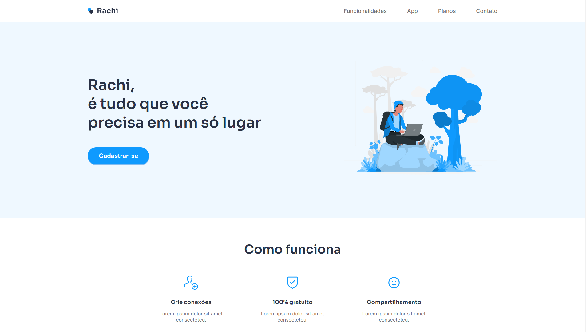

## 📖 Projeto

Este projeto que foi proposto no grupo do discord, CodeLândia.

## 🧪 Tecnologias

Esse projeto foi desenvolvido com as seguintes tecnologias e bibliotecas:

- [React](https://reactjs.org)
- [Styled-components](https://styled-components.com/)


## 🚀 Como executar

Clone o projeto e acesse a pasta do mesmo.

```bash
$ git clone git@github.com:d0ugui/rachi.git
$ cd rachi
```

Para iniciá-lo, siga os passos abaixo:

```bash
# Instalar as dependências
$ yarn or npm

# Iniciar o projeto
$ yarn start or npm start
```

O app estará disponível no seu browser pelo endereço http://localhost:3000/

## 📝 License

Esse projeto está sob a licença MIT.
