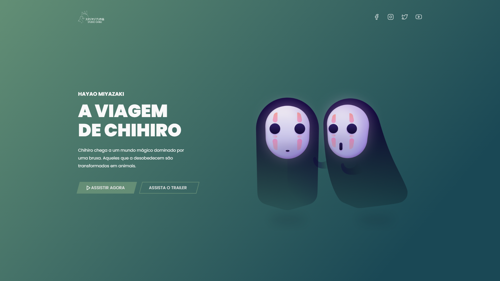

## 📖 Projeto

Este projeto foi idealizado por [Iuri Silva](https://www.instagram.com/iuricode/), e faz parte de um desafio proposto no grupo do discord, [Codelândia](https://discord.com/invite/QevDJqCzaY).

## 🧪 Tecnologias

Esse projeto foi desenvolvido com as seguintes tecnologias:

- HTML/CSS
- JavaScript
- [ScrollReveal](https://scrollrevealjs.org/)

## 🚀 Como executar

Clone o projeto e acesse a pasta do mesmo.

```bash
$ git clone https://github.com/d0ugui/studio-ghibli.git
$ cd studio-ghibli
```

Para iniciá-lo, basta rodar o projeto com o Live Server.

## 🎨 Layout

Você pode ter acesso ao layout do projeto no figma clicando [aqui](https://www.figma.com/file/Yb9IBH56g7T1hdIyZ3BMNO/Desafios---Codel%C3%A2ndia?node-id=5854%3A2)

## 📝 License

Esse projeto está sob a licença MIT.
